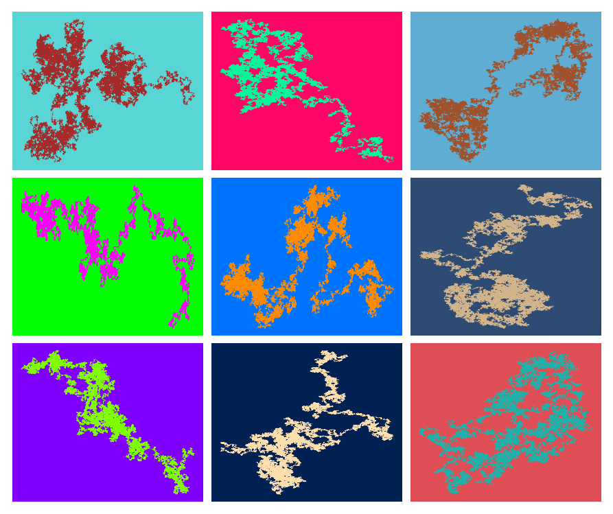
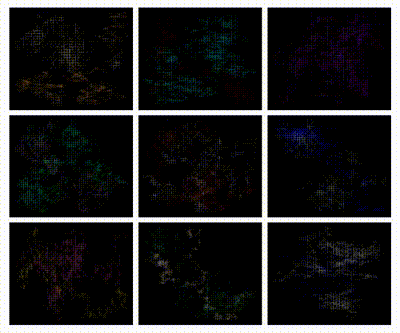

# Code for: _Walking nowhere in particular_ (2020) and _A la Recherche de Vera Molnár_ (2019).

## Table of Contents
* [General info](general-info)
* [Walking nowhere in particular](#Walking-nowhere-in-particular)
* [Homage to Vera Molnár](#Homage-to-Vera-Molnár)
* [Requirements](requirements)

## General info
This repository contains the code used to create _Walking nowhere in particular_ (2020) and _A la Recherche de Vera Molnár_ (2020), two algorithmic artworks. The text below introduces both works and summarizes each file and it's function, with further comments provided throughout the code. To create your own images simply load the example notebooks, executing cells one by one, or run the scripts in your terminal.

## Walking nowhere in particular (2020)

All random walk visualizations are generated using the script `SWRdrawer` found in `Code/`; at each step the location is programmed to jump to a neighbouring site according to a predefined probability distribution and step count. The images will be saved to a directory called `Images/`. `SRWdrawer.ipynb` provides examples of how to run the script. Afterwards, you will have a collection of still images from which a video can be created by stitching the images into a gif or mp4: 

 

## A la Recherche de Vera Molnár (2019)

Pioneer of algorithmic computer art Vera Molnár (aged 96 at the time of writing and still working) once said, "the machine, thought to be cold and inhuman, can help to realize what is most subjective, unattainable, and profound in a human being". Taking inspiration from this sentiment, _A la Recherche de Vera Molnár_ is a simple, short script that shows how a few lines of code and standard import libraries can be used to create abstract visualizations. Conceptually showing  bring an element of surprise, color, and suspense, which is often not attained when relying just on human intuition and control.

 

## Requirements
- Python 3.7.7
- Matplotlib 
- Jupyter

Please follow the online instructions to install the required libraries, depending on your operating system and machine specifications. 

This code is being released with a permissive open-source license. You should feel free to use or adapt the code as long as you follow the terms of the license.  
